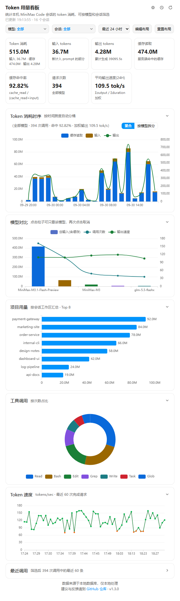

# Token 用量看板

[English](README.md) | 简体中文

近实时查看本机 MiniMax Code 的 Token 用量：消耗趋势、输出速度、缓存命中率、模型对比、项目用量排行、工具调用统计和最近请求，可按时间范围、模型和会话筛选。

作者：[yanhy2000](https://github.com/yanhy2000) · 版本：`1.3.0`

*预览中的会话与用量均为合成数据。应用界面目前为中文。*

## 安装与使用

把本目录整体复制到用户目录下的 `.minimax/plugins/` 里。各系统的目标位置：

| 系统 | 目标位置 |
| --- | --- |
| Windows | `C:\Users\<用户名>\.minimax\plugins\mcode-usage-monitor` |
| macOS | `/Users/<用户名>/.minimax/plugins/mcode-usage-monitor` |
| Linux | `/home/<用户名>/.minimax/plugins/mcode-usage-monitor` |

`<用户名>` 就是你的系统登录名。`.minimax` 是隐藏文件夹：Windows 需在资源管理器里勾选「显示隐藏的项目」，macOS 在访达里按 `Cmd + Shift + .` 才会显示。装过 MiniMax Code 的话它一般已经存在，直接放进去即可。

复制时不要漏掉 `.minimax-plugin` 隐藏目录，插件靠它被识别。解压 zip 或拖拽整个文件夹都可以，只要最终形成上表中的完整路径。

完成后重启支持 MiniApp 的 MiniMax Code，确认插件已启用，然后打开「Token 用量看板」，或在对话里让 Agent 打开。如果给 MiniMax Code 设置了自定义数据目录（环境变量 `MINIMAX_DATA_DIR`），则放进该目录下的 `plugins/` 里。

页面默认显示最近 24 小时，可切换今天（自当天 00:00 起）/ 1 小时 / 12 小时 / 24 小时 / 7 天 / 30 天 / 全部，也可输入整数小时自定义范围（1–8760 小时，只保留最近输入的一条）。支持按模型和会话多选筛选，两侧列表互相牵制：模型列表只显示所选会话中出现过的模型，会话列表只显示所选模型出现过的会话，对应一侧选「全部」时才展示该侧完整列表；全选按钮在全部选中时置灰，反选始终可用，也允许全部不选（此时页面数据为 0）。项目用量排行按会话工作区目录汇总，工具调用统计来自每次请求的工具调用记录，两者都跟随当前筛选。每张卡片可收起 / 展开；点击「编辑布局」进入编辑模式后，顶部数字方块与下方卡片（无论展开还是收起）都可以拖拽排序，也可以点 ✕ 从页面移除，「保存布局」退出并记住排列，「取消保存」放弃本次修改，「重置布局」一键恢复全部显示与默认排列，均不影响上方的筛选条件。筛选条件、时间范围、刷新间隔、主题、方块与卡片的显示和排列都会被记住。页面默认每 10 秒自动刷新（可切换 5 秒 / 10 秒 / 30 秒或手动刷新）。

本插件需要本机已安装 **Python 3.8+** 用于读取本地数据库；只用标准库，无需 `pip install`。其自带 SQLite 需启用 JSON1 扩展（SQLite 3.38+ 与 Python 官方构建均默认启用，缺失时页面会提示具体原因）。不需要 API Key 或其他配置。

## 数据与统计口径

数据来自两处本地来源：

- `<dataDir>/v2/sqlite/runtime-state.sqlite`：通过 SQLite 官方 backup API 建立只读内存快照，不锁库，不影响正在运行的客户端。
- `<dataDir>/v2/sessions`：扫描真实会话文件（`messages.jsonl`）用于生成会话列表。

统计规则：

- Token 消耗 = 输入 + 缓存读取 + 输出；缓存命中率 = 缓存读取 /（缓存读取 + 输入）
- 按 `msg_id` 跨会话去重：会话重建时历史消息会被复制进新会话，同一批调用只计一次

本工具是本地近实时观测，计费与额度以产品内「用量」页为准；产品内数字来自服务端统计，存在延迟（实测约一天内补齐），也可能有自己的口径。

运行时不向外部服务发送任何数据，无遥测；只向 Host 提供的插件数据目录写入一个偏好文件（`prefs.json`）。页面会显示真实会话标题、工作区目录路径（可能含用户名与项目名）和工具名称，分享截图时请注意。

## 源码与验证

页面位于 `miniapp/client/index.html`（ECharts 已本地化打包），Node 入口位于 `miniapp/node/server.mjs`，数据后端位于 `miniapp/node/api.py`，无需构建。

已验证环境：MiniMax Code 桌面端 `3.0.73.166`，Windows（10.0.26200，x64）。开发过程中已验证：插件安装与打开、数据聚合与去重、模型/会话筛选、偏好记忆、自动刷新、主题切换、图表与列表渲染、时间范围预设与自定义输入校验、筛选全不选、编辑布局（拖拽排序与移除）、顶栏图标化与最近调用表格优化、模型与会话列表交叉筛选（双向收窄）、模型对比卡空态提示、Esc 收起下拉面板、偏好文件原子写入。macOS 与 Linux 未验证。

第三方组件：[ECharts](https://echarts.apache.org/)（Apache License 2.0），已本地化打包以便离线使用。

## 许可证

[MIT](LICENSE)。
